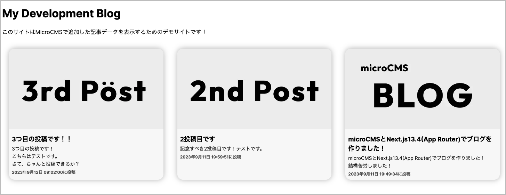

# Next.js13.4でmicroCMSでブログコンテンツを取得する

Next.js13.4でmicroCMSで書いたブログコンテンツを取得するためのリポジトリです。以下のような見た目になります。
あくまで表示するためのデモなので、ルーティングは実装していません。クローンは自己責任でお願いします。



## 事前準備
microCMSでプロジェクトとAPIを新規作成してください。<br>
参考:https://document.microcms.io/manual/create-api<br>
なお、こちらのリポジトリでは<br>
API型はリスト形式<br>
APIスキーマは<br>
title<br>
content<br>
eyecatch<br>
を使用しています。


## 起動方法
パッケージのインストール
```
npm install
```
.envを作成

```
.env.exampleを.envに変えて、それぞれにmicroCMSで発行された下の3つを入力して下さい
SERVICE_DOMAIN
API_KEY
END_POINT
```
起動する
```
npm run dev
```


